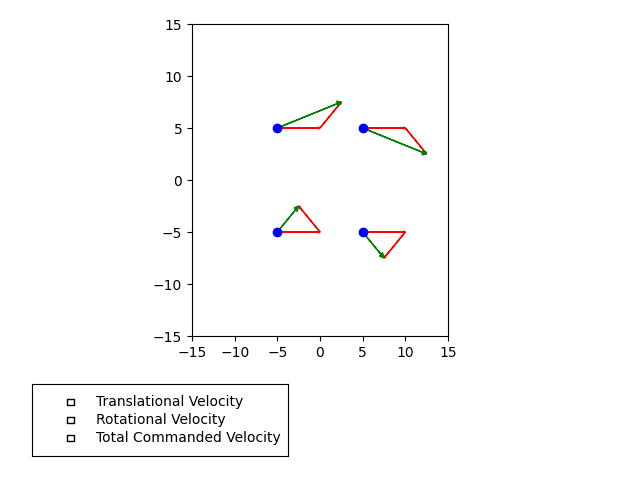
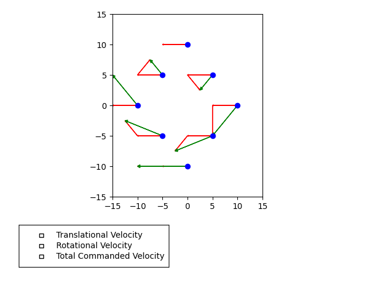

# First Robotics Competition Offseason 2024 Codebase

This is a copy of the [original repository](https://github.com/Drew-Robotics/offseason-2024) off of the github page for the FRC robotics team I'm on (#8852). I wanted to keep this description I'm writing here off of the page that represents the whole team.

## Tools Used
Java, gradle, wpilib, PhotonVision, PathPlanner, and various vendor libraries to interact with hardware on the robot (rev robotics, kauai labs, playing with fusion, and others).
Also tools to control the robot and read data like Shuffleboard and AdvantageScope.

## Work Split
This was a collaboration with the [other programmer on the team](https://github.com/Pickles888), who implemented some older features from the 2024 on-season robot as an exercise, as well as some early versions of the intake and feeder subsystems. The areas I'm highlighting are parts that I had exclusively worked on.

## Vision

Last year was our first robot that employed cameras and made use of vision tools like photon vision. The goal is to be able to read data from four different cameras with known positions relative to the robot, detect april tags (they look like small QR codes) also with known positions relative to the field, to try and work backwards to find the position of the robot relative to the field. We made use of black and white cameras from Arducam, and two Orange Pi's running PhotonVision. We had to set up a custom field at the school where we're located which is why all the april tags have random looking hardcoded positions.

## Drivetrain

For the past year or so we've been working on swerve drive robots, a type of drivetrain where for each "module" there is a motor to spin a wheel, and another to orient it. Enough of these modules results in a type of drive called holonomic drive, where regardless of position and orientation, the robot can be sent off in any direction, allowing for some really interesting and complex maneuvers while moving the robot. This isn't the first swerve drive subsystem I've written but when writing this version there was a major focus on readability, organization, maintainability, and personalization to our team. It was my first time working on a swerve drive with another person, so this wasn't just a coding project, but a teaching project as well, one of the reasons why I wanted this to be as readable as possible. I also created a smaller [Python demo](https://github.com/njbizzle/SwerveDriveDemo) right at the start of the project to show the math behind the swerve drive.

### Some Images From the Swerve Math Demo

#### Example With 4 Modules (I've never seen a team that doesn't do 4 modules)

#### Example With 8 Modules (It's cool to see and it demonstrates how general the math is)

## LEDs

I got pretty annoyed trying to use other people's LED code. CTRE (the company that made all the hardware) had a pretty unintuitive and limited system for managing what pattern was being sent to the LEDs. I wrote a small bit of code to manage different patterns, states, mix patterns, transition between patterns, and a few other tools. I ended up really enjoying it just as a design project, and it turned out really well. You describe patterns with a function that takes in variables like time, progress through the defined LED strip, and a few other factors that can be set up, then you just need to return a color. It makes it super simple because all these patterns can be described mathematically.

This existed in some form on our on-season robot, and it made it really easy to convey the state of the robot from really far away. Overall it's a super general tool and I'm really happy with how it turned out.

Here's an older example pattern.

We also made use of these tools to have the led stip indicate where the cameras detected a vision target to be. It pretty much just illuminated the LEDS that were in the direction of the target, and the number of LEDs illuminated corresponded to the target distance. I don't really have an easy way to set that up again and sadly I never documented it.
